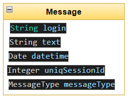
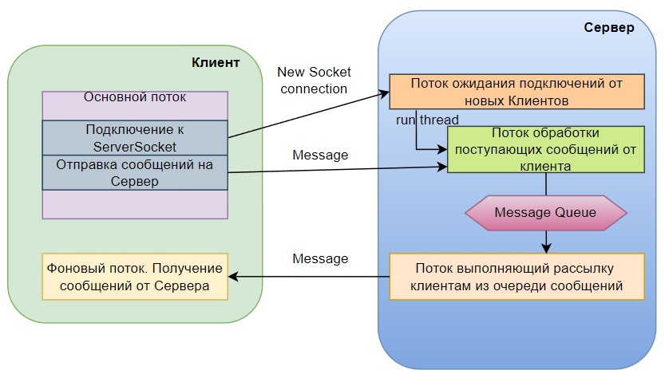

# Курсовой проект "Сетевой чат"
В проекте приложения собраны несколько модулей которые в целом описывают и составляют общую картину проекта

## Описание протокола обмена

В качестве протокла обмена для реализации поставленной задачи было решено использовать объект класса Message которые имплементирует интерфейс Serializable и обладает рядом полехных 
свойств которые будут использованы при передаче инфомрации от клиента на сервер, обработки сообщений на сервер и отправки сообщений участникам чата
Socket и ServerSocket обмениваются "объектами" которые в процессе передачи и обработки проходят процесс Сериализации\Десериализации 
Классы Message и MessageType описаны в модуле contract

Описание свойств отраженных на схеме:
* **login** - логин пользоватетя. Заполняется по умолнанию значением nologin, после регистрации каждый из клиентов пишет при создании экземпляра объекта свой login. Правда на стороне сервер реализовано свое определение login на основании данных регистрации и уникльного номера socket полученного от клиента в момент его первого подключения.
* **text** - текст самого сообщения который направляет клиент другим пользователям 
* **datetime** - дата вркмя формирования сообщения 
* **uniqSessionId** - уникальный идентификатор Socket клиента, далее будет использован для идентификации подключенного клиента для связи списка пользователей и очереди сообщений
* **messageType** - тип объекта сообщения реализовано в enum. Сообщения могут быть двух типов: для клиента и для других клиентов. Будет использовано во время процесса разбора очереди сообщений и определения типа рассылки: тому же кто отправил или остальным за исключением того кто отправил.

## Описание общей архитектуры проекта
Схематичное изображеие архитектуры

### 1. Серверная часть состоит из нескольких основных классов:
   * **ApplicationServer** - класс содержащий метод main. Организован для запуска Сервера
   * **Server** - класс отвечающий за инициализацию параметров сервера и запуск основных потоков обработки
   * **ServerWaitClientHandler** - класс имлементирующий интерфейс Runnable организован как класс который работает в отдельном потоке (поток создается в единственном виде) и который ожидает подключений новых клиентов к серверу. Для процесс ожидания используется цикл (фактически бесконечный) , условие на выход из цикла -завершение работы ServerSocket.
    На каждое подключение нового клиента создается отдельный поток в виде экземпляра класса ServerReceiverMessageHandler, который будет обрабатывать сообщения нового клиента
   * **ServerReceiverMessageHandler** - класс имлементирующий интерфейс Runnable организован как класс который работает в отдельном потоке (количество потоков соответвуте количеству клиентов подключившихся к северу) и обрабатывает сообщения определнного клиента, в результате обработки сообщений от каждого клиента заполняется общаяя очередь сообщений на Сервере.
   * **ServerSenderMessageHandler** - класс имлементирующий интерфейс Runnable организован как класс который работает в отдельном потоке (поток создается в единственном виде), класс обрабатывает очедь сообщений и выполняет рассылку для подключенных клиентов учитывая тип сообщений.
 ### 2. Клиентская часть состоянии также из нескольких классов:
   * **ApplicationClient** - класс содержащий метод main. Организован для запуска Клиента
   * **Client** - класс выполняющий функцию диалога с пользователем , формирование и отправку сообщений
   * **ClientSettings** - класс служащий для инициализации параметров клиентской части перед запуском клиента
   * **ClientReceiveHandler** - класс имплементирующий интерфейс Runnable запускается в фоновом процессе и служит для обработки полученных сообщений от Сервера

### 3. Журналирование сервера и клиента
Также реализован модуль Logger которые записывает всю неоходимую информацию в текстовый файл с расширением log
У логгера есть возможность управления уровнем логирования, который задается в настройках логгера
